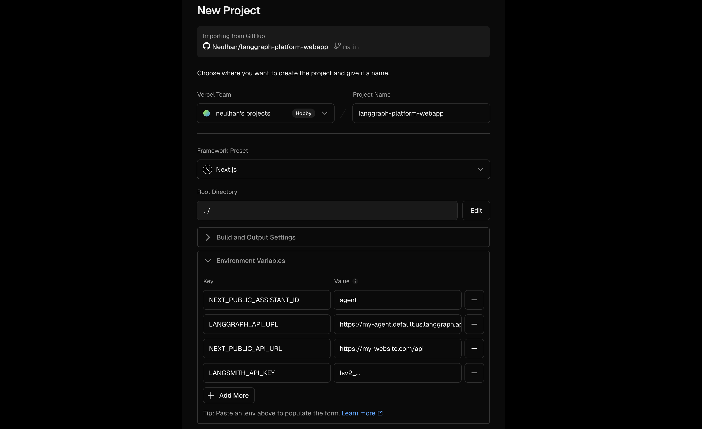
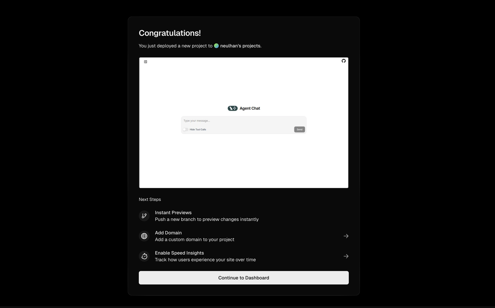
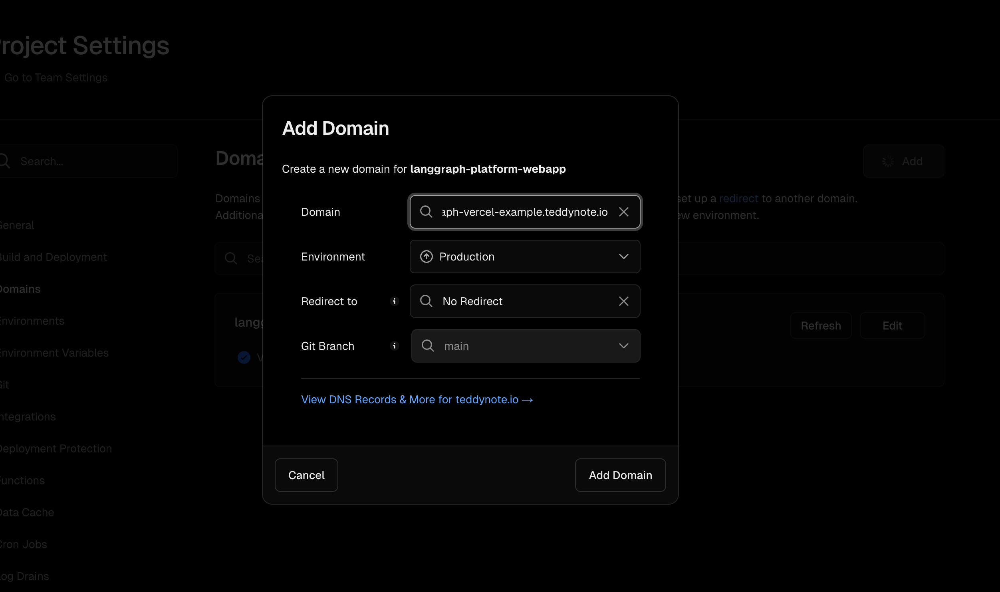
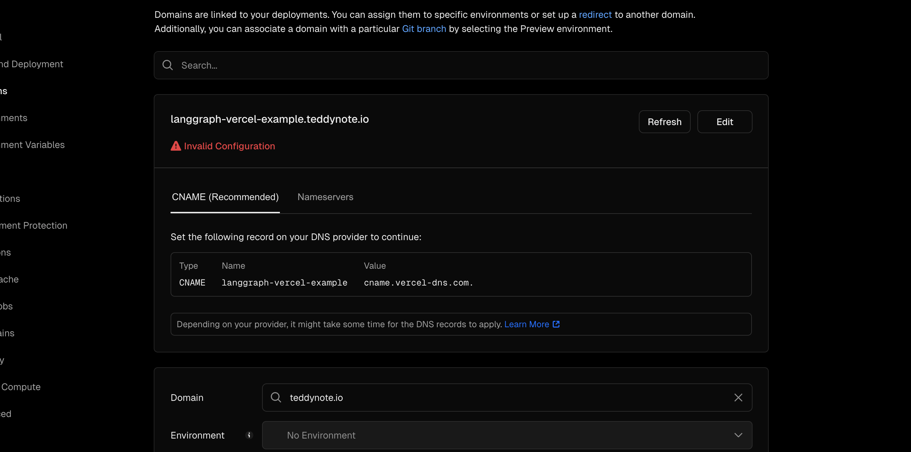
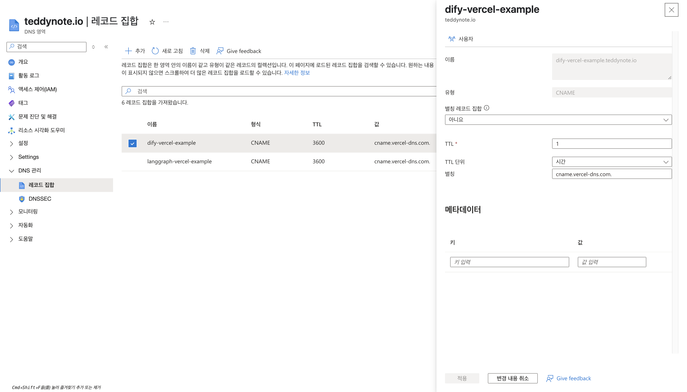
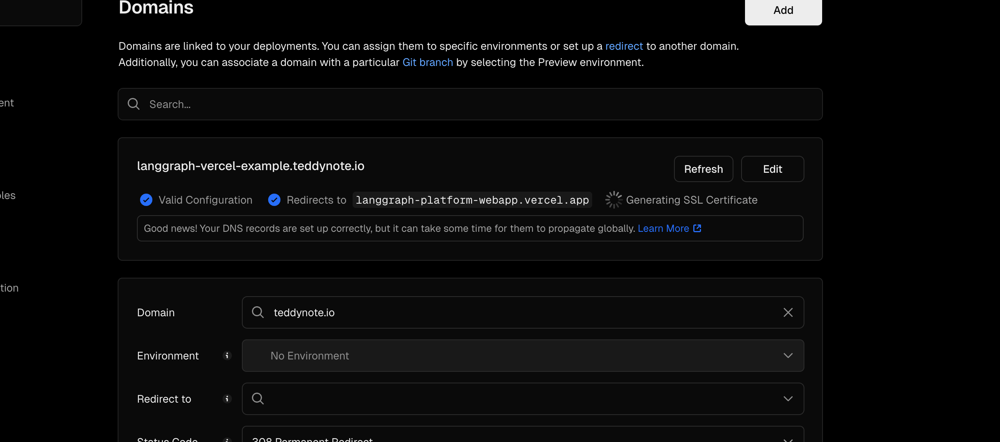

# 🖥️ LangGraph Platform WebApp

LangGraph Platform WebApp 은 `messages` 키를 가진 모든 LangGraph 서버와 채팅 인터페이스를 통해 대화할 수 있는 Next.js 애플리케이션입니다.

> [!NOTE]
> LangGraph Platform WebApp 은 LangGraph 의 공식 템플릿인 [Agent Chat UI](https://github.com/langchain-ai/agent-chat-ui) 의 포크 버전입니다.

## 🔥 기존 Agent Chat UI 와 다른 점

- .env 에서 로고 이미지, 타이틀 설정 가능
- Vision Model 을 위한 이미지 파일 업로드 기능 추가 (본 Repo 는 PR 대기중)
- 사용자 별 쓰레드 구분 (LocalStorage 로 UserID 관리)
- UI 텍스트 한국어 번역

## 설정

> [!NOTE]
> 🎥 설정 가이드 비디오를 [여기](https://youtu.be/lInrwVnZ83o)에서 시청하세요.

먼저 저장소를 Clone 하거나 Use this Template 혹은 [`npx` 명령어](https://www.npmjs.com/package/create-agent-chat-app)를 실행하세요:

```bash
npx create-agent-chat-app
```

또는

```bash
git clone https://github.com/langchain-ai/agent-chat-ui.git

cd agent-chat-ui
```

의존성 설치:

```bash
npm install

or

yarn

or

pnpm install
```

앱 실행:

```bash
npm run dev

or

yarn dev

or

pnpm dev
```

앱은 `http://localhost:3000`에서 사용할 수 있습니다.

## 💁 사용법

앱이 실행되면 다음 정보를 입력하라는 메시지가 표시됩니다:

- **Deployment URL**: 대화하고 싶은 LangGraph 서버의 URL입니다. 이는 프로덕션 또는 개발 URL일 수 있습니다.
- **Assistant/Graph ID**: 채팅 인터페이스를 통해 실행을 가져오고 제출할 때 사용할 그래프의 이름 또는 어시스턴트의 ID입니다.
- **LangSmith API 키**: (배포된 LangGraph 서버에 연결할 때만 필요) LangGraph 서버로 전송된 요청을 인증할 때 사용할 LangSmith API 키입니다.

이러한 값을 입력한 후 `Continue`를 클릭하세요. 그러면 LangGraph 서버와 채팅을 시작할 수 있는 채팅창으로 이동합니다.

## ⚙️ 환경 변수

다음 환경 변수를 설정하여 초기 입력값을 우회할 수 있습니다:

```bash
NEXT_PUBLIC_API_URL=http://localhost:2024
NEXT_PUBLIC_ASSISTANT_ID=agent
```

> [!TIP]
> 프로덕션 LangGraph 서버에 연결하려면 [프로덕션으로 전환](#프로덕션으로-전환) 섹션을 읽어보세요.

이러한 변수를 사용하려면:

1. `.env.example` 파일을 `.env`라는 새 파일로 복사하세요
2. `.env` 파일에 값을 입력하세요
3. 애플리케이션을 다시 시작하세요

이러한 환경 변수가 설정되면 애플리케이션은 초기 입력값 대신 이 변수들을 사용합니다.

```
# .env

# LangGraph API URL
NEXT_PUBLIC_API_URL=http://localhost:2024
# LangGraph Graph or Assistant ID
NEXT_PUBLIC_ASSISTANT_ID=agent
# 앱 이름
NEXT_PUBLIC_APP_NAME=teddynote LAB
# 앱 로고
NEXT_PUBLIC_APP_LOGO=/teddynote-logo.png
LANGSMITH_API_KEY=
```

## 🎨 앱 로고 커스텀

1. `/public` 폴더에 원하는 로고 이미지 파일을 첨부합니다.
2. `.env` 의 `NEXT_PUBLIC_APP_LOGO` 를 수정합니다.

## 🚜 프로덕션 배포

이미 Next.js 프로젝트에 익숙하신 분들은 [Agent Chat UI 의 가이드](https://github.com/langchain-ai/agent-chat-ui?tab=readme-ov-file#going-to-production) 를 참고하세요

Next.js 에 익숙하지 않으신 분들은 아래 가이드를 참고해주세요

### Vercel 로 3분 안에 배포하기

1. 이 Repository 를 클론 or Use this Template 을 통해, 본인의 Repository 로 생성
2. 해당 Repo 를 [Vercel 페이지](https://vercel.com/new) 에서 권한 부여해서 가져오기
3. 해당 Repo 를 Import 버튼 누르고 환경변수 입력 후 > Deploy 버튼 클릭
   
4. 배포 완료
   

#### (추가) 커스텀 도메인 연결

1. 위의 배포 완료 화면에서 Add Domain 버튼을 누르거나 Project Settings > Domains > Add 를 통해 해당 화면 진입
   
   Domain 입력칸에 원하는 도메인 입력 (ex. www.teddynote.com) 후 Add Domain 버튼 클릭
2. 아직 도메인 라우팅 테이블 설정이 안되었기 때문에 Invalid Configuration 에러 발생
   
3. DNS 테이블에 CNAME 추가 (가비아, namecheap 등 DNS 호스팅 사이트에는 모두 이 기능이 있습니다)
   
4. 추가 후 기다리면 자동으로 커스텀 도메인 연결 + https 설정
   


## License
MIT License
